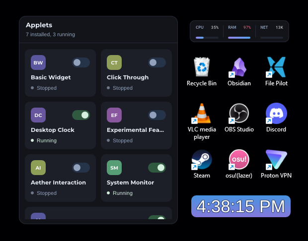
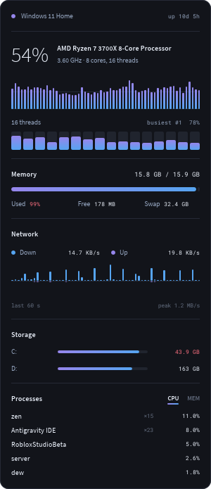
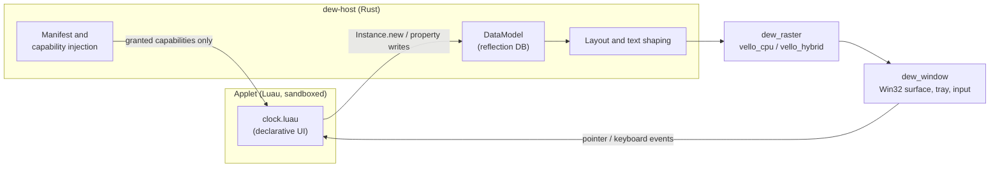

<div align="center">


# Dew

**Sandboxed desktop applets written in Luau and drawn by a native Rust renderer.**

[](https://github.com/dew-desktop/dew/actions/workflows/ci.yml)


[](LICENSE)

<br />



<br />
<sub>Dew's quick panel managing installed applets alongside running desktop widgets</sub>

</div>

---

Dew runs sandboxed desktop utilities called **applets**: clocks, hardware monitors, and HUDs. Each applet is authored in Luau, runs in an isolated guest environment, and renders using a native Rust rasteriser - no browser engine, Electron, or external runtimes required.

Applets construct their interface using declarative UI datamodel objects that are familiar to Luau developers (`Frame`, `TextLabel`, `TextButton`, `UIListLayout`, `UDim2`, `Color3`, etc.), implemented standalone, from scratch, in Rust, to run natively on desktop.

## Featured Applets

### System Monitor

[`examples/system/monitor/monitor.luau`](examples/system/monitor/monitor.luau) is a real-time hardware telemetry HUD showcasing dynamic visualizations and host telemetry gated by `desktop.System`.

<div align="center">



</div>

```toml
id = "monitor"
name = "System Monitor"
description = "CPU, cores, memory, network, storage and top processes, live"

# Capabilities granted to the guest VM
permissions = ["widget", "storage", "system"]
```

- **Live hardware telemetry:** Monitors CPU utilization, memory pressure, network throughput, disk space, and top active processes.
- **Dynamic visualizations:** 60-second rolling CPU graph, 16 individual core bars, dual-channel network waveform, and memory consumption meters.
- **Window management:** Smooth dragging with display edge snapping (`snapToEdges = true`) and position persistence across restarts (`savePosition = true`).
- **Capability-governed:** Access to telemetry is strictly gated by the host under the `system` permission.

### Desktop Clock

[`examples/clock/clock.luau`](examples/clock/clock.luau) is a minimalist, floating desktop clock widget demonstrating reactive UI updates and state persistence without external dependencies.

<div align="center">


</div>

```toml
id = "clock"
name = "Desktop Clock"
description = "A minimalist, draggable desktop clock with live seconds and format toggle"

# Capabilities granted to the guest VM
permissions = ["widget", "storage"]
```

- **Vertical gradient styling:** Rounded widget with vertical gradient fill and outline styling (`UIGradient`, `UICorner`, `UIStroke`).
- **Window management:** Smooth dragging with display edge snapping (`snapToEdges = true`) and position persistence across restarts (`savePosition = true`).
- **Interactive toggle:** Click anywhere on the clock to toggle between 12-hour and 24-hour formats, saved across launches via `desktop.Storage`.
- **Automatic timezone detection:** Resolves local time and timezone offsets via `desktop.Time`.

## Quick start

**Requirements:** a Rust toolchain (`rust-toolchain.toml`) and [Rokit](https://github.com/rojo-rbx/rokit).

```sh
# Clone the repository
git clone https://github.com/dew-desktop/dew
cd dew

# Install pinned developer tools (lune, etc.)
rokit install

# Run the applets
cargo run examples/system/monitor
cargo run examples/clock
```

While running, Dew manages the widget lifecycle, handles window dragging and snapping, and sits quietly in the Windows system tray.

### CLI Reference

| Command                               | What it does                                                                                  |
| :--------------------------------------| :----------------------------------------------------------------------------------------------|
| `dew <path>`                          | Run the applet in the specified directory                                                     |
| `dew check <path>...`                 | Validate manifests and entry points                                                           |
| `dew snapshot <path> -o out.png`      | Render a single frame to PNG headlessly                                                       |
| `dew snapshot <applet-id> -o out.png` | Save the frame a running applet is showing, or render its installed copy if it is not running |
| `dew test <path>`                     | Run an applet's interaction tests                                                             |
| `dew compat`                          | Report which applets are portable across environments                                         |
| `--stats`                             | Print a granular breakdown of layout and paint frame time                                     |
| `--bench`                             | Force repaints every frame to measure continuous drag workload                                |

## Architecture



| Crate | Responsibility |
| :--- | :--- |
| [`host`](host) | The `dew` binary: applet loader, manifests, capability injection, DataModel, layout, tray, and dashboard |
| [`crates/runtime`](crates/runtime) | Embeds Luau through `mlua`. Rust owns the process; Luau executes as a guest |
| [`crates/raster`](crates/raster) | Translates display lists to pixels. CPU rasterization by default, GPU acceleration via feature flag |
| [`crates/window`](crates/window) | Native window management, swapchains, system tray, and input events on Windows |

### Highlights

- **Deny-by-default sandbox.** Every applet runs in its own isolated Luau VM with no raw `io`, `os`, or FFI access. An applet can only reach capabilities explicitly granted in its manifest (e.g. storage, notifications, clipboard). The host injects each capability as a function, keeping security boundaries strictly auditable and testable in Rust.
- **Engine-independent DataModel in Rust.** The class hierarchy, properties, and defaults are driven by an engine reflection database, allowing the host to statically reject properties that do not exist on a class before values reach the layout pipeline. It covers 139 of 139 in-scope GUI properties.
- **Native rendering pipeline.** Layout, text shaping, strokes, gradients, clipping, and scrolling go through a high-performance CPU rasteriser built on [`vello_cpu`](https://github.com/linebender/vello), with an optional GPU backend via `vello_hybrid` and `wgpu`.
- **Verified layout conformance.** A shared [conformance suite](https://github.com/project-aether-ui/aether/tree/main/conformance) runs data-driven layout cases across implementations, asserting exact bounding boxes, text bounds, and flex allocations. A differential gallery validates that property mutations produce expected pixel changes.
- **Fast frame budgets.** Release builds render frames in approximately 1.7 ms. The built-in `--stats` flag profiles frame time across layout, shaping, and rasterization passes.
- **Headless testability in CI.** `dew snapshot` renders arbitrary applet frames directly to PNG without opening a window, allowing comprehensive integration tests to run in automated CI pipelines on Windows and Linux.

## Development

```sh
cargo test --workspace                     # Rust unit and integration suites
lune run scripts/smoke.luau                # CLI validation checks
lune run scripts/verify_boundaries.luau    # Architecture boundary enforcement
cargo run --bin gallery-coverage           # Differential rendering coverage
```

CI builds on Windows, validates applet mounting, renders the gallery on Linux, and enforces formatting and clippy lints.

See [CONTRIBUTING.md](CONTRIBUTING.md) for workflow details. Contributions require signing the [CLA](CLA.md).

## Related Projects

- **[Aether](https://github.com/project-aether-ui/aether)**: A headless Luau UI framework. Components run on Dew, across engine environments, and headlessly in CI.

## License

| Component | License |
| :--- | :--- |
| Client (`host/`, `crates/`) | [PolyForm Shield 1.0.0](LICENSE): permitted for all uses except competing commercial products |
| Specification (`docs/`) | [MIT](docs/LICENSE), allowing third-party implementations to adopt the standard |
| Applets | Authored applets maintain their own licenses and never link against Dew |

---

<sub>Dew is an independent project and is not affiliated with or endorsed by Roblox Corporation. See [NOTICE](NOTICE).</sub>
